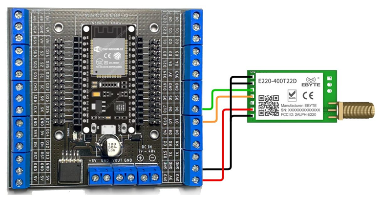
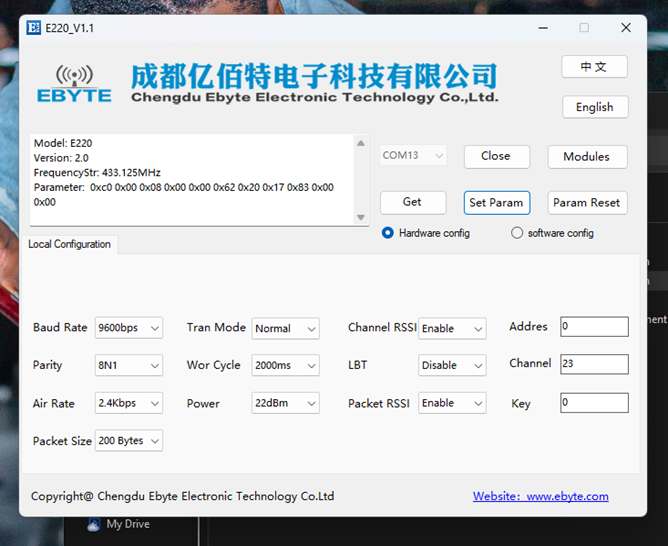
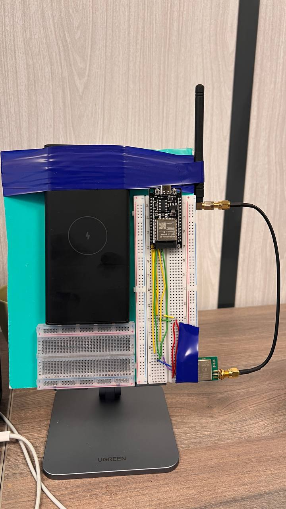
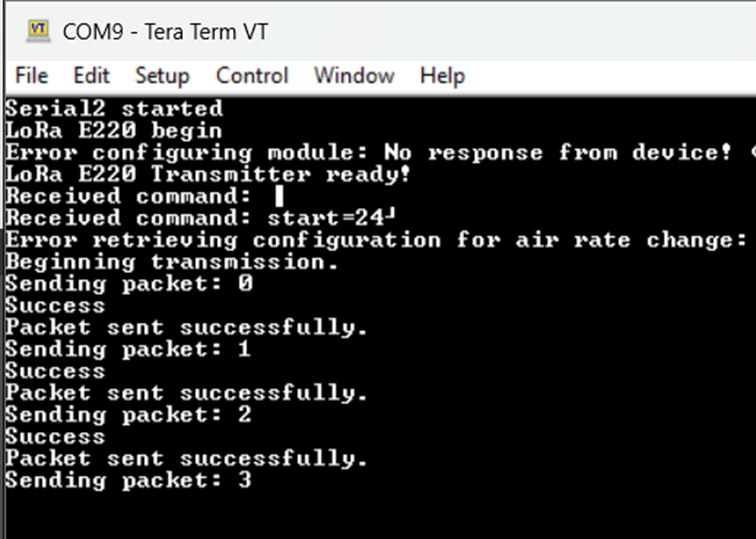
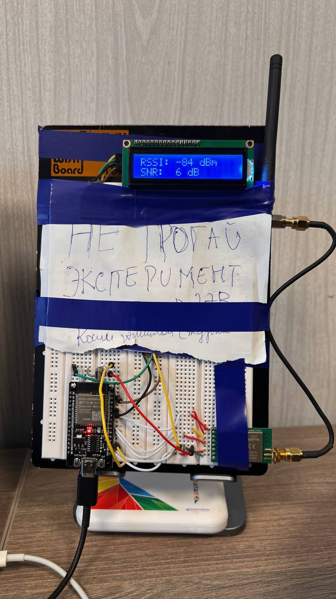
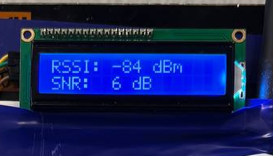
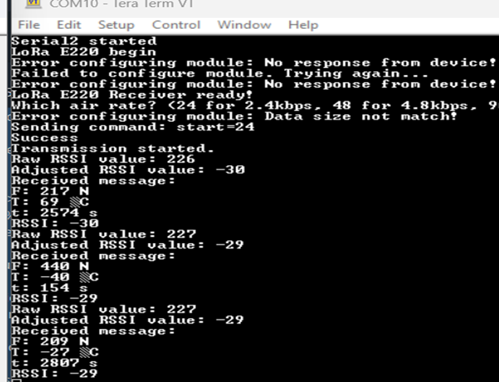
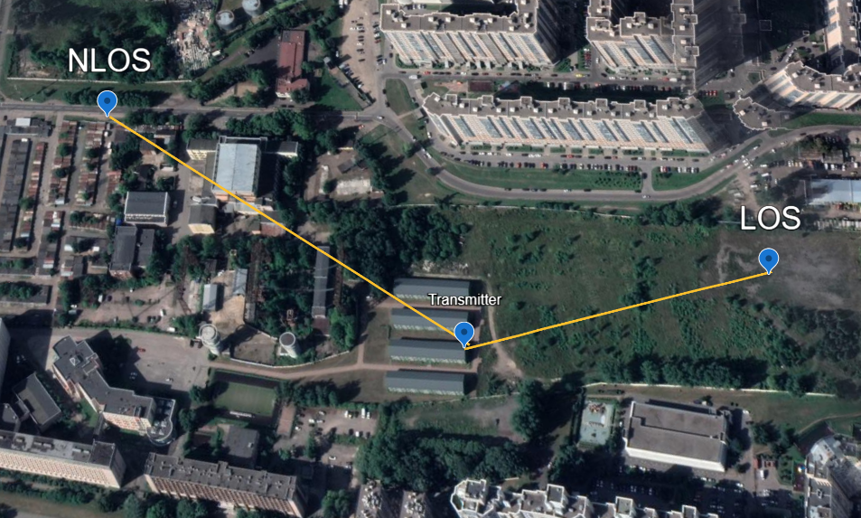
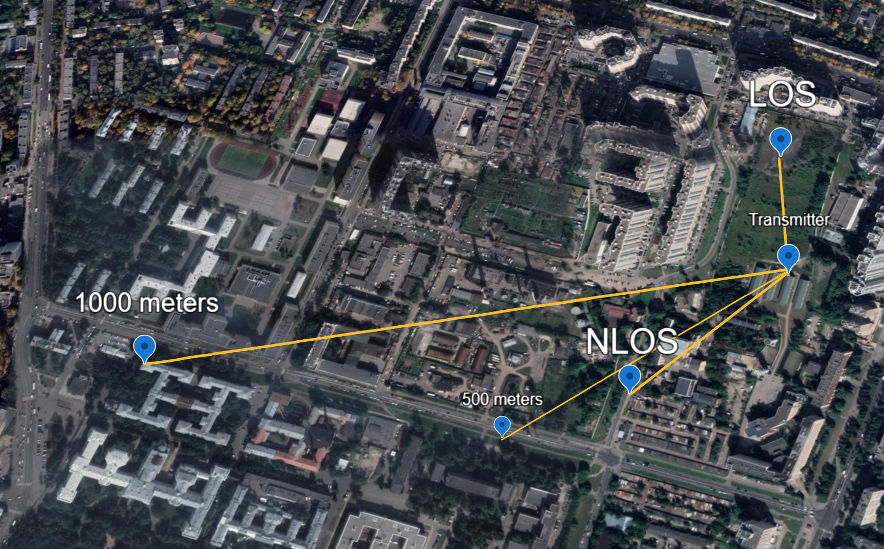

# **LoRa Communication with ESP32**

This project implements long-range point-to-point communication using **LoRa E220-400T22D** modules with **ESP32** microcontrollers. The project includes both a transmitter and a receiver for sending and receiving sensor data, while calculating **RSSI** and **SNR**.

---

## **1. LoRa Configuration**

### **1.1 Hardware Configuration**
**ESP32** is connected to the **LoRa E220-400T22D** module with the following pinout:

| **ESP32 Pin** | **LoRa Pin**  |
|---------------|---------------|
| 3.3V          | VCC           |
| GND           | GND           |
| D19           | M0            |
| D21           | M1            |
| TX2 (17)      | RX            |
| RX2 (16)      | TX            |
| D18           | AUX           |

**Wiring Diagram**:  

---

### **1.2 Software Configuration**
Using the **Ebyte Configuration Tool**, configure the following parameters:

| **Parameter**       | **Value**      |
|----------------------|----------------|
| Baud Rate           | 9600 bps       |
| Air Rate            | 2.4 kbps       |
| Transmission Power  | 22 dBm         |
| Channel             | 23             |
| Packet Size         | 200 Bytes      |

**Ebyte Configuration Example**:  

---

## **2. Transmitter Setup**

### **2.1 Overview**
The **transmitter** sends simulated sensor data:
- **Force** (N).
- **Temperature** (°C).
- **Time** (s).

The data is transmitted as:

### **2.2 Setup Image**

### **2.3 Terminal Output**
The transmitter sends data packets periodically:  

---

## **3. Receiver Setup**

### **3.1 Overview**
The **receiver** captures the transmitted data and calculates:
- **RSSI**: Received Signal Strength Indicator.
- **SNR**: Signal-to-Noise Ratio.

### 3.2 Formulas

**RSSI Calculation**:  
RSSI (dBm) = -(256 - RSSI)

**SNR Calculation**:  
SNR (dB) = P_signal (dBm) - P_noise (dBm)

### **3.3 Receiver Setup Image**

### **3.4 Receiver Output**
**Display on LCD**:  

**Serial Monitor Output**:  

---

## **4. Test Results**

### **4.1 Test Locations**
Experiments were performed under **Line-of-Sight (LOS)** and **Non-Line-of-Sight (NLOS)** conditions at various distances:

1. **LOS and NLOS**:
   

2. **200(NLOS),500,935 meters**:
   

---

## **5. How to Run the Project**

1. **Hardware Setup**:
   - Connect the LoRa modules to the ESP32 as shown in the wiring diagram.

2. **Software Setup**:
   - Install the **LoRa_E220** library in Arduino IDE.
   - Upload `Transmitter.ino` to the transmitter ESP32.
   - Upload `Receiver.ino` to the receiver ESP32.

3. **Monitor the Data**:
   - Use the **Serial Monitor** at **9600 baud rate** to observe the results.

---

## **6. Troubleshooting**

- **"No Response from Device"**:
  - Verify wiring between ESP32 and LoRa module.
  - Ensure correct voltage levels (3.3V).

- **Weak Signal (RSSI)**:
  - Reposition the antennas for better alignment.
  - Increase transmission power in software configuration.

---

## **7. Contact**
- **Developer**: **Amilton Koxi**
- **Email**: **amiltonkoxi2024@outlook.pt**

---

